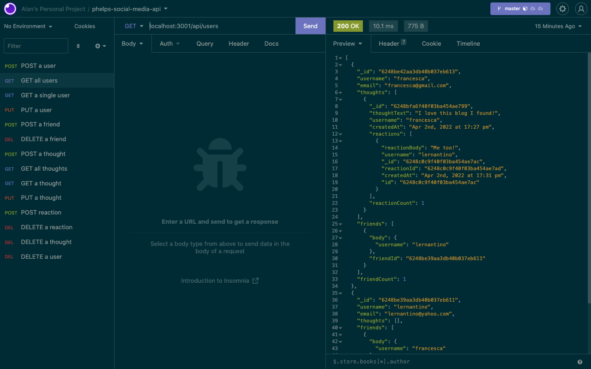

# phelps-social-media-api

## Description

This project sets up a backend API for a social media platform, allowing one to input, view, update, and/or delete users, their thoughts, and any reactions to those thoughts.

## Table of Contents

- [Installation](#installation)
- [Usage](#usage)
- [Demo](#demo)
- [Contributing](#contributing)
- [Questions](#questions)

## Installation

Run npm i in a terminal integrated with the project root file to install the necessary packages, then run npm start to fire up the server. You'll have to set up the routes in a testing program of your choice (I used Insomnia) at the endpoints specified in the user-routes and thought-routes files in the routes/api/ directory in order to try them out.

## Usage

This can be used as a starting backend for a social media platform. It's just waiting for a frontend to connect to it!

## Demo

Check out this API in action by going to [this link](https://drive.google.com/file/d/1rnE9P5jrvC2ktlyjA4TWMPQT-KfTWE3W/view).

## Screenshot

## Contributing

Please reach out to me if you would like to collaborate. My information can be found below in the [Questions](#questions) section.

## Questions

- GitHub: [sora64](https://github.com/sora64/)

- Email: If you have any other questions, please reach me at [phelpsa64@gmail.com](mailto:phelpsa64@gmail.com).
